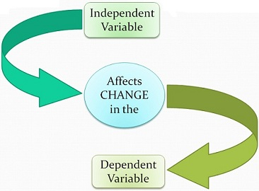
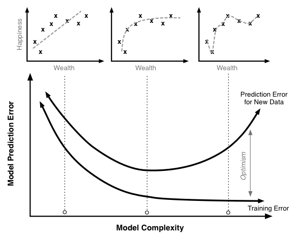
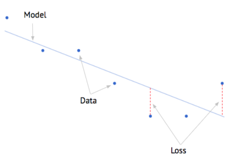

# Statistical Learning Theory

## Introduction

In this lesson, we will look at a brief introduction to the Statistical Learning Theory and some key components in the framework of this theory. The is a particularly important theory as it encompasses majority of statistical inference and functional analyses approaches that we will come across later in the course. Statistical learning theory has led to successful applications in fields such as computer vision, speech recognition, bio-informatics and sports etc.

## Objectives

You will be able to: 

* Understand and describe the statistical learning theory 
* Understand dependent and independent variables as key components of statistical learning approaches
* Give an introduction on model development and model parameters
* Demonstrate a basic understanding of ideas of model loss and model validation

## Statistical Learning

> Statistical learning theory is a framework for machine learning drawing from the fields of statistics and functional analysis. Statistical learning theory deals with the problem of finding a predictive function based on data. **The goal of statistical learning theory is to study, in a statistical framework, the properties of learning algorithms.**

So how do we get started on this? what does it involve? Statistical learning refers to tools and techniques that enable us to investigate and understand data in a better way. 

## Types of data in statistical learning 

In the context of Statistical learning, there are two types of data:

* **Data that can be controlled directly OR independent variables** 
* **Data that cannot be controlled directly OR dependent variables**

Note: There is a third type of variable called a **controlled** variable used for control/clinical testing. We shall visit that later. 

Two examples of common independent variables are age and time. There’s nothing you or anything else can do to speed up or slow down time or increase or decrease age. They’re independent of everything else.

An example of a dependent variable is how much you weigh at different ages. Here , the dependent variable (weight) depends on the independent variable (age).

> **The dependent variable is actually 'dependent' on the independent variable. As the experimenter changes the independent variable, the effect on the dependent variable is observed and recorded.**

Independent and dependent variables are normally shown on a graph under a standardized approach. This makes it easy for you to quickly see which variable is independent and which is dependent when looking at a graph or chart. 

COnventionally, the independent variable goes on the x-axis, or the horizontal axis. For the height-weight data that we saw in earlier labs, a scatter plot may look as shown below. Here we have set height as independant and weight as a dependent variable i.d. **we want to study if height has some effect on weight**:

## Statistical Model 

> **A statistical model can be thought as some kind of a transformation that helps us express dependent variables _AS A FUNCTION_ of independent variables**. 

### A statistical model essentially defines a **Relationship** between a dependent and an independent variable. 

For the plot we see above, the relationship between height and weight can be shown using a **straight line** connecting all the individual observations in the data. So this line here would be our **model** as shown in the image below. 

We can define and **fit** such a straight line to our data following a straight line equation: 

$$y = m  x + c$$ 

Such a simple model would describe a person's height has **almost** a linear relationship with weight i.e. weight increases with height. 

. 

So this is our simple model for the relationship. Of course we can use more sophisticated models like quadratic equations or polynomial equations for a **better fit**, and we shall see that with advanced modeling techniques. Let's get back to our plain old straight line for now. 

Looking at this line above, we can define is as **Weight = -143 + 3.9 * Height**, based on slope(m) and intercept(c) values for **y = mx+ c**.  

This would be our **Linear model** (Linear refers to a model consisting a straight line, w.e. linear regression), which can help us work out a weight value for a given height.  

In some cases you may put to change the orientation of data and try to predict height based on an individual's weight. That's all got to do with the question you are trying to ask. 

> A model is expressed as a mathematical equation showing the relationship between dependent and independent variables. 

## Statistical Model Parameters

>> **Model Parameters are the co-efficients of the model equation for estimating the output**. 

Statistical Learning is all about learning these parameters. A statistical learning approach would help us **learn** these parameters so we have a clear description of their relationship which we can replicate and analyze under different circumstances. 

For the straight line above, we need to learn the **slope** and **intercept** for the line that best describes the relationship between the data elements in the dataset.

Once we have learned the $m$ and $c$ values, we can predict a value of $y$ ( weight in our example) for a given value of $x$ (the height above). In our next lab, we shall see how to calculate these for a given dataset.  Let's have a look at another example:

### What determines an individual's income? 

If we suppose that income is a a function of employee's number of years of education, and years of experience. A model that estimates the income could look like:

$$income = c + β_0  education + β_1  experience$$

Here we have two independent variables i.e. education and experience, with a single dependent variable i.e. salary. 

This is how we would understand the model:

- $β_0$ and $β_1$ are model parameters that express income as a function of education and experience.

- Education and experience (Independent variables) are also called as **features** of the model.

- Income (dependant) is uncontrollable variable also known as a **target**.

## Model Generalization

As the data which is available to us for modeling is finite Data is finite, the available data needs to be used very efficiently to build and **validate** a model. Validation of the model usually makes the model more **Generalizable** for unseen situations. 

Training the model is like infancy stage for humans. Examples are presented to the model and the model tweaks its  parameters to better understand the data. Once the training is over, the model is unleashed upon new data and then uses what it has learned to explain that data.  This is where problems can emerge. If we **over-train** the model on the training data i.e. make the model every detail of shown data, it will be able to identify all the relevant information in the training data, but will fail miserably when presented with the new data. 

We then say that the **model is incapable of generalizing**, or that **model is overfitting the training data**. 

Here's a great example of the phenomenon: modelling happiness as a function of wealth. 

The top three diagrams we have data and models (dashed curves). From left to right the models have been trained longer and longer on the training data. The training error curve in the bottom box shows that the training error gets better and better as we train longer (increasing model complexity). You may think that if we train longer we'll get better! Well, yes, but **only better at describing the training data**. The top right box shows a very complex model that hits all the data points. This model does great on the training data, but when presented with new data (examine the Prediction error curve in the bottom box) then it does abysmally. 

In order to create good predictive models in machine learning that are capable of generalizing, one needs to know when to stop training the model so that it doesn't overfit.

### Model Validation

>**Model validation is a process of controlling overfitting and allow a higher degree of generalizability.**

Here is how we perform validation, in its simplest form:

* Split the data into two parts with a 70/30 , 80/20 or s similar split.

* Use the larger part for training so the model learns from it. This set of data is normally called the **Training Data**

* Use the smaller part for testing the model. This is data is kept away from the model during learning process and used only for testing the performance of a learned model. This dataset is called as the **Testing Data.**

This setup looks like as shown below:

In statistical learning, if the model has learned well from the training data, it will perform well on the test data and that would be our measure of accuracy. It is assessed based on how close it has estimated the output to the actual value.

## Model Loss 

> **A loss function method of evaluating how well your model represents the relationship between data variables**. 

If the model can not figure out the underlying relationship between independent and dependent variable(s), the loss function outputs a very high number. Consider the weight-height example above, we can see the linear model is not exactly touching each data point because these points do not exist in a line. the individual distance of each point from the line is **loss** that the model exhibits. 

These individual losses are taken into account to calculate the overall model loss. 

If the relationship is well modeled, the loss function will be a lower value. As we change parameters of our model to try and improve results, our loss function is our best friend, telling us if we are on the right track. 

Below is an example loss function known as **Sum of Squares** loss. This calculates a loss for fitting straight line to set of variables (as in our case above) and measure the distance between data points and line to measure the level of LOSS. 

We shall go into details of this particular loss function in upcoming lessons. 
In fact, we can design our own (very) basic loss function to further explain how it works. 

## Summary 

In this lesson we briefly looked at statistical learning theory and its main components. We looked at what a statistical model is and what the model parameters. We looked at this in context of most simple model, a straight line. Next we shall see the "Learning" part of statistical learning theory by learning learning slope and intercept parameters of a straight line. 
